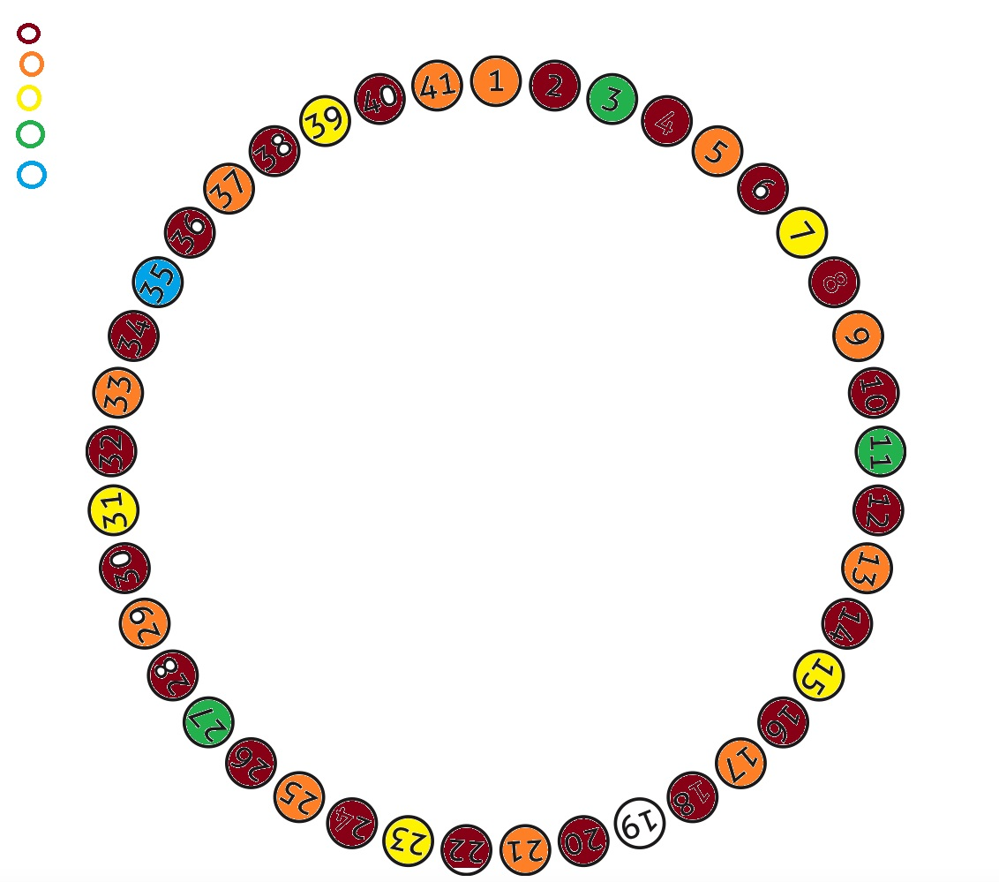
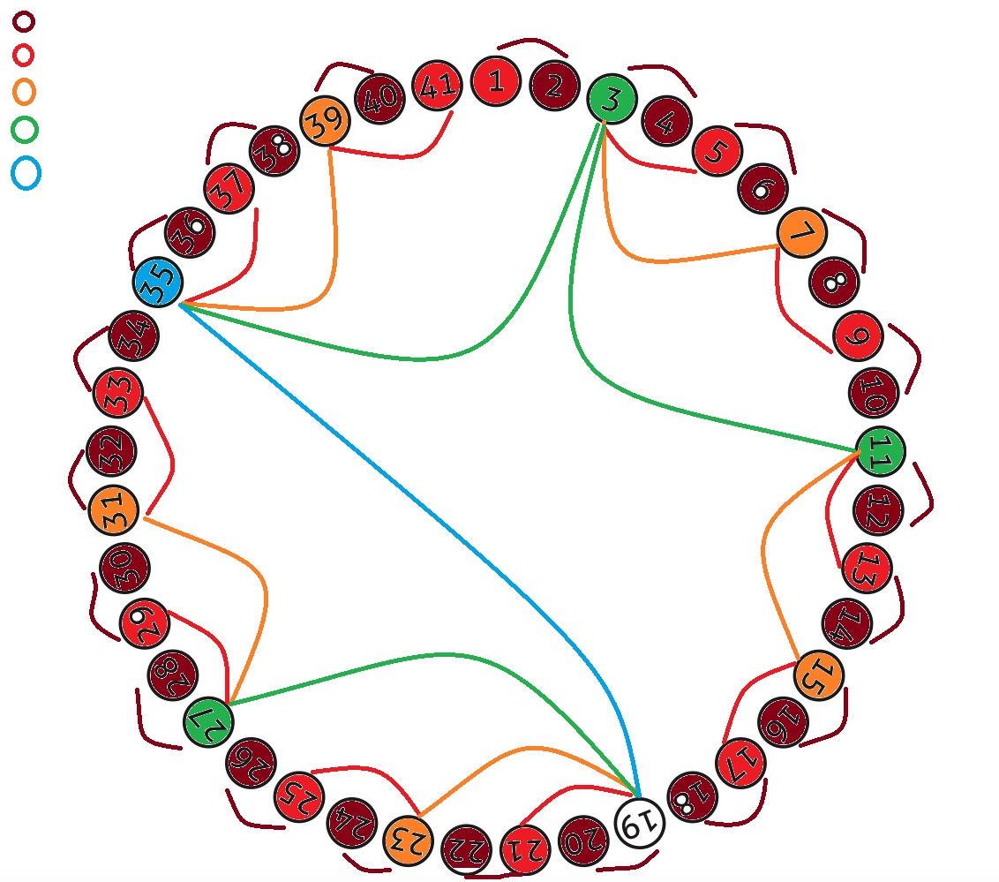
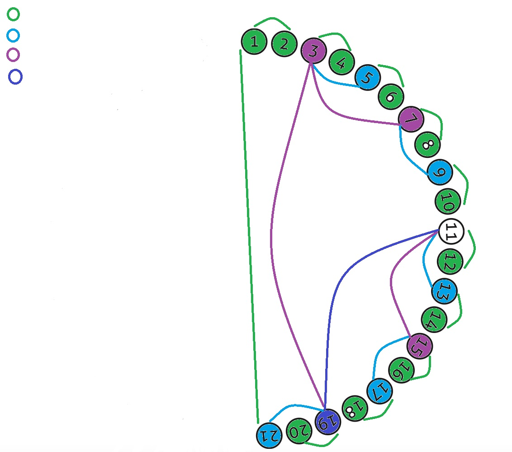
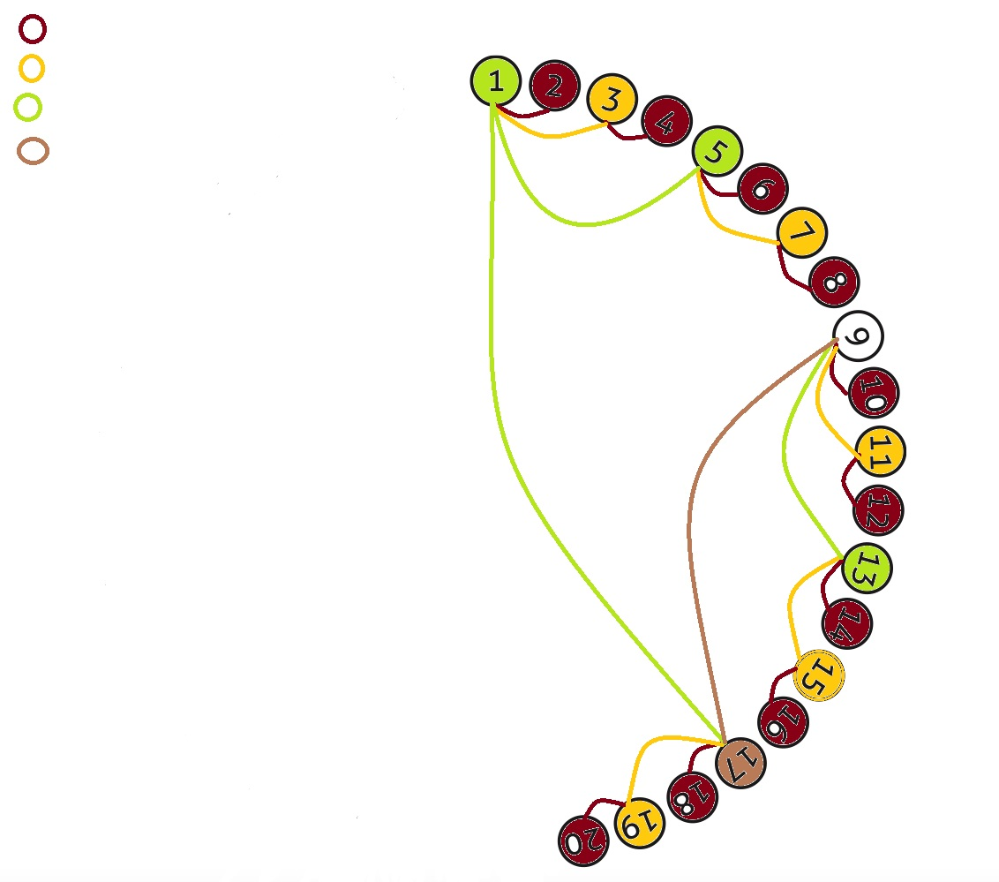
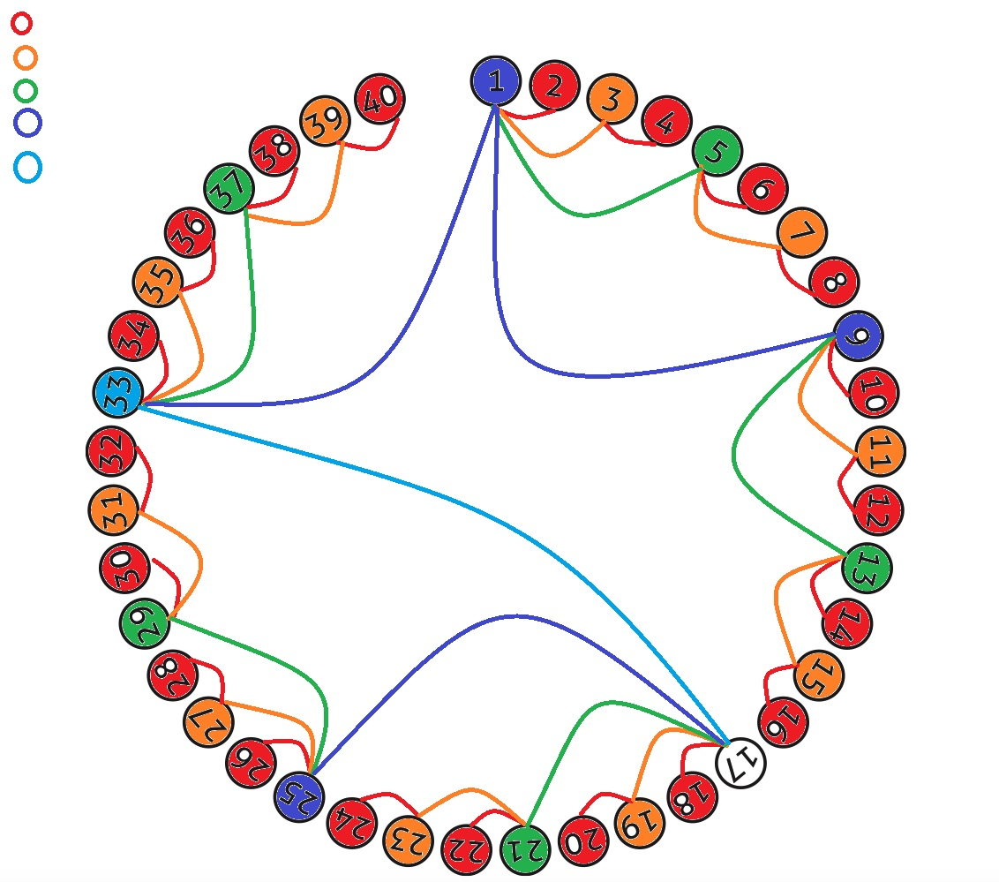

# Problema de Flavius Josephus

Como se van eliminando en sentido horario y en el problema inicial son 41, fui por rondas, a primera instancia vemos que se van eliminando las posiciones pares, luego cada cuatr impares, luego cada 8, 16, hasta que quedaron el 19 y el 35 donde el 19 mato al 35 y quedo vivo el 19

Con más conexiones las secuencias:

Si analizamos los datos, podriamos decir que para este caso tomariamos la mediana que es 21, menos 2, para que nos de 19

veamos si esto nos sirve para numeros impares de grupos más pequeños:

Viendo que para un grupo impar de 21, si aplica la regla de la media, pero ya no el restarle 2, en este caso se salva el 11

***
### Analizemos ahora para grupos pares

Para grupo de 20, queda vivo el 9:

Para grupo de 40 queda el 17:

Aqui ya podemos empezar a ver patrones, primero se van eliminando los pares, luego de 4 en cuatro, 8,16... 

y que los sobrevivientes se llevan ocho lugares, en impares del 11 al 19 y en pares del 9 al 17

Podemos ir desarrollando una solución, analizando primero si son par o impar los grupos, luego la cantidad de datos, sabemos que los pare siempre son los que mueren primero y la posición que debemos tomar siempre sera impar, investigando, la fromula para sacar que posición debemos tomar es cno esta formula

>J(n,m)=(J(n−1,m)+m−1)mod n+1

**Conclusión**

No entendí la formula,pude hacer deducciones pero no sacar una formula como tal intente con listas más pequeñas pero no pude concluir un patron, te diria que mejor le calcules manualmente para saber que posición tienes que tomar o mejor suicidate o no juegues ese juego, ahorras tiempo.

los resultados que me dieron fueron:
<table>
  <tr>
    <th>No. de participantes</th>
    <th>Posición que vive</th>
  </tr>

  <tr>
    <td>1</td>
    <td>1</td>
  </tr>

  <tr>
    <td>2</td>
    <td>1</td>
  </tr>

  <tr>
    <td>3</td>
    <td>3</td>
  </tr>

  <tr>
    <td>4</td>
    <td>1</td>
  </tr>

  <tr>
    <td>5</td>
    <td>3</td>
  </tr>

  <tr>
    <td>6</td>
    <td>5</td>
  </tr>

  <tr>
    <td>7</td>
    <td>7</td>
  </tr>

  <tr>
    <td>8</td>
    <td>1</td>
  </tr>

  <tr>
    <td>9</td>
    <td>3</td>
  </tr>

  <tr>
    <td>10</td>
    <td>5</td>
  </tr>

  <tr>
    <td>11</td>
    <td>7</td>
  </tr>

  <tr>
    <td>12</td>
    <td>9</td>
  </tr>

  <tr>
    <td>13</td>
    <td>11</td>
  </tr>

  <tr>
    <td>14</td>
    <td>13</td>
  </tr>

  <tr>
    <td>15</td>
    <td>11</td>
  </tr>

  <tr>
    <td>16</td>
    <td>1</td>
  </tr>

  <tr>
    <td>20</td>
    <td>9</td>
  </tr>

  <tr>
    <td>21</td>
    <td>11</td>
  </tr>

  <tr>
    <td>40</td>
    <td>17</td>
  </tr>

  <tr>
    <td>41</td>
    <td>19</td>
  </tr>
 
</table>
