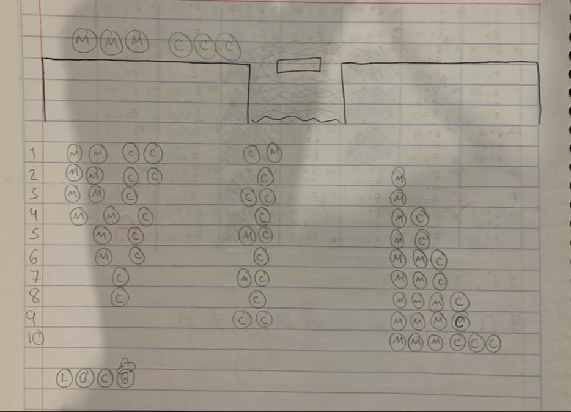

# Reglas y Búsquedas : Espacio de Estados

## Ranas

Para generar el espacio de estados del problema de las ranas, primero identifiquemos los elementos clave del problema:

- **Estado inicial:** Representa la configuración inicial del tablero con las ranas. En este caso, podríamos tener las ranas verdes a la izquierda y las ranas marrones a la derecha.

- **Acciones:** Las acciones posibles que pueden tomar las ranas en cada movimiento. En este caso, las ranas pueden saltar a una piedra vacía que tengan delante o saltar por encima de otra rana si en medio de ambas hay una piedra vacía.

- **Estado objetivo:** Representa la configuración que se busca alcanzar, donde las tres ranas verdes están a la derecha y las tres ranas marrones están a la izquierda.

Vamos a representar las posiciones de las ranas con "G" para las ranas verdes, "B" para las ranas marrones y "_" para las posiciones vacías. Además, usaremos la notación "Rana_" para representar la posibilidad de que una rana pueda saltar a esa posición.

Entonces, un estado posible podría ser algo como:

> GBB_GBG

Donde las tres ranas marrones están a la izquierda y las tres ranas verdes a la derecha. Las acciones posibles incluirían, por ejemplo, que la rana marrón en la posición 3 salte hacia la derecha.

> BBB_GGG

Ahora, generemos el espacio de estados. La complejidad del problema radica en que hay múltiples acciones posibles en cada estado, y algunas acciones pueden llevar a estados que ya se han visitado.

> BBBG_GG

> BB_GBGG

> B_BGBGG

> BGB_BGG

> BGBGB_G

> BGBGBG_

> BGBG_GB

> BG_GBGB

> _GBGBGB

> G_BGBGB

> GGB_BGB

> GGBGB_B

> GGBG_BB

> GG_GBBB

> GGG_BBB

## Misioneros y Canibales

Este problema puede ser modelado como un problema de búsqueda en el espacio de estados. Vamos a definir los elementos clave del problema:

Estado inicial: Representa la situación inicial con tres misioneros y tres caníbales en una orilla del río, y el bote vacío en esa misma orilla.

Acciones: Las acciones posibles son mover uno o dos misioneros o caníbales al otro lado del río. El bote tiene capacidad para dos personas, ya sean misioneros, caníbales o una combinación de ambos.

Estado objetivo: Representa la situación en la que todos los misioneros y caníbales han cruzado el río y se encuentran en la orilla opuesta.

