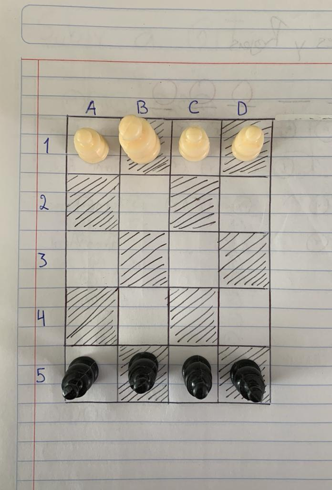

# Introducción a la Inteligencia Artificial: Introspección

La introspección (del latín «"introspicere" (mirar en el interior)») o inspección interna designa la idea de «mirar al interior». Se trata del conocimiento que el sujeto pueda adquirir de sus propios estados mentales, o sea, designa la situación, para un sujeto dado, de observarse y analizarse a sí mismo, interpretando y caracterizando sus propios procesos cognitivos y emotivos, por lo tanto se requiere resolver el siguiente problema analizado la forma es que usted mismo resuelve el problema

Coloca ocho alfiles (cuatro negros y cuatro blancos) en un tablero de ajedrez reducido, tal como se ve en la figura. El problema consiste en hacer que los alfiles negros intercambien sus posiciones con los blancos, ningún alfil debe atacar en ningún momento otro del color opuesto. Se deben alternar los movimientos, primero uno blanco, luego uno negro, luego uno blanco y así sucesivamente. ¿Cuál es el mínimo número de movimientos en que se puede conseguir?.

Yo consegui cambiar las posiciones de los alfiles en 16 movimientos pero en futuros intentos llegue a otros 16 que pudieran ser mejor, a continuación los movimientos:

- Primeros 16:

> blanco 5D -> 2A 1
> negro  1B -> 3D 2
> blanco 2A -> 1B 3
> negro  1D -> 3B 4
> blanco 5A -> 2D 5
> negro  3B -> 5D 6
> blanco 5B -> 4A 7
> negro  3D -> 5B 8
> blanco 4A -> 1D 9
> negro  1A -> 3C 10
> blanco 5C -> 4D 11
> negro  3C -> 5A 12
> blanco 4D -> 1A 13
> negro  1C -> 3A 14
> blanco 2D -> 1C 15
> negro  3A -> 5C 16

- Los 16 más optimos:

> blanco 5D -> 2A 1
> negro  1B -> 3D 2
> blanco 2A -> 1B 3
> negro  1D -> 3B 4
> blanco 5A -> 2D 5
> negro  3B -> 5D 6
> blanco 5B -> 4A 7
> negro  3D -> 5B 8
> blanco 4A -> 1D 9
> negro  1A -> 3C 10
> blanco 5C -> 4D 11
> negro  1C -> 3A 12
> blanco 2D -> 1C 13
> negro  3C -> 5A 14
> blanco 4D -> 1A 15
> negro  3A -> 5C 16
